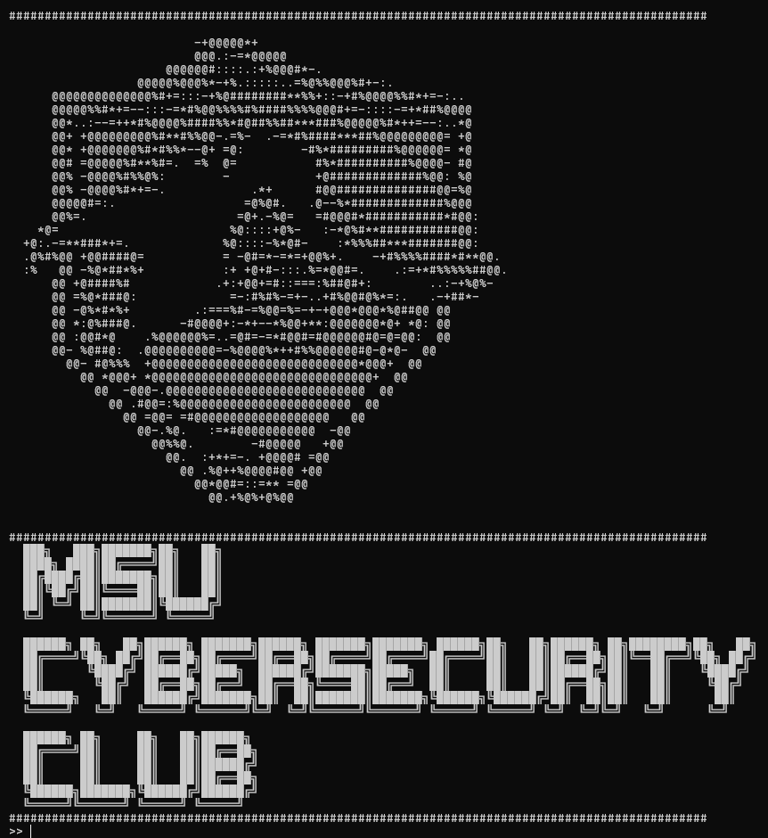

# MSUSecurityClub-Tool-BruteForceAttackTesting

# How to run

-   type `pip install -r requirements.txt`
-   type `python main.py -h` to see help

# How to run if don't have python

-   Download Bruteforce.exe on releases
-   Open Command Prompt with same path of Bruteforce.exe
-   type `Attack -h` to see help

# Example Command
## Run on python
-   `pip install -r requirements.txt`
-   `python main.py -u a@a.com -p 0987***321 -m POST http://example.com/login`
## Run on exefile
-   `cyber -u a@a.com -p 0987***321 -m POST http://example.com/login`
